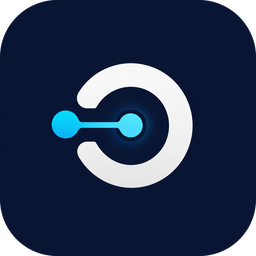

<p align="center">
  
</p>

<h1 align="center">DockStart</h1>

<p align="center">
  面向 AutoDock Vina 的中文本地分子对接工作台
</p>

<p align="center">
  从结构准备、对接箱体设置和任务运行，到构象查看、结果解析与实验记录导出。
</p>

<p align="center">
  
  
  
  
</p>

<p align="center">
  <a href="https://github.com/xuxinxi14/DockStart/releases">下载</a>
  · <a href="docs/user_guide.md">使用指南</a>
  · <a href="docs/faq.md">常见问题</a>
  · <a href="CHANGELOG.md">更新记录</a>
  · <a href="docs/license_notes.md">第三方许可证</a>
</p>

---

DockStart 是一个基于 [AutoDock Vina](https://vina.scripps.edu/) 的第三方开源桌面应用。它不开发新的 docking 算法，而是把分散的命令行步骤整理成清晰、可追踪的中文工作流，帮助初学者减少格式、路径、参数和结果归档方面的错误。

> 当前源码版本为 **v0.10.2**。v0.10.2 是本轮 Windows 首发候选；在四个安装包完成构建和安装态验收前，最近一次同时覆盖 Basic 与 Assisted、打包目录与真实安装目录的完整验收基线仍为 **v0.10.0**。安装包不提交到 Git 仓库，请以 [GitHub Releases](https://github.com/xuxinxi14/DockStart/releases) 中实际发布的版本、门禁结果和校验值为准。

## 为什么使用 DockStart

- **完整工作流**：在同一个项目中完成输入准备、Box、Vina 参数、运行、构象查看和报告导出。
- **中文引导**：解释每一步要做什么、为什么要做，以及阻塞时应该检查什么。
- **本地优先**：对接、结构准备、项目记录和诊断均在本机执行；只有主动使用 RCSB/PubChem 下载时需要联网。
- **可复现**：保存输入快照、配置、命令、工具版本、stdout/stderr、结果、时间和 SHA256。
- **不隐藏科学边界**：自动准备、Box 定位和 docking score 都需要人工判断，不会被描述成真实结合或药效证明。

## 选择安装版本

DockStart 提供两个 Windows x64 发布 profile。二者使用同一个应用身份，请勿并行安装。

| | Basic Stable | Assisted Stable |
| --- | --- | --- |
| 适合谁 | 已有受体和配体 PDBQT | 只有受体 PDB/CIF 与配体 SDF/MOL |
| 内置 AutoDock Vina | 是，1.2.7 | 是，1.2.7 |
| 内置后端 Python | 是，精简运行时 | 是，独立 CPython 3.11 运行时 |
| 内置 RDKit / Meeko | 否 | 是，RDKit 2026.3.3 / Meeko 0.7.1 |
| PDB/SDF/MOL → PDBQT | 不提供 | 可离线尝试准备 |
| PDBQT 对接完整流程 | 支持 | 支持 |
| 典型安装包体积 | 较小 | 较大 |

如果不确定：

- 已经有 `receptor.pdbqt` 和 `ligand.pdbqt`：选择 **Basic Stable**。
- 只有 `.pdb`、`.cif`、`.sdf` 或 `.mol`：选择 **Assisted Stable**。
- 只想了解软件流程：安装任一版本后打开内置示例。

> 当前安装包尚未进行 Authenticode 签名，Windows SmartScreen 可能显示“未知发布者”。发布者字段应为 `XinXi Xu`，安装前仍应核对 Release 页面提供的 SHA256。

## 六步完成一次对接

```text
创建或打开项目
      ↓
导入已有 PDBQT，或在 Assisted 中从 raw 文件准备 PDBQT
      ↓
检查受体、配体和对接箱体
      ↓
设置 Vina 参数并通过运行前检查
      ↓
执行 AutoDock Vina
      ↓
查看构象与 scores，导出 Markdown 实验记录
```

1. **创建项目**：选择本地目录，DockStart 建立独立的项目文件结构。
2. **准备输入**：Basic 直接导入受体/配体 PDBQT；Assisted 可搜索或导入 PDB/CIF、SDF/MOL，并在写入项目后立即尝试生成 PDBQT。
3. **设置搜索范围**：在 3D 工作台检查结构和 Box，输入中心及尺寸；可按受体坐标范围快速定位，再人工微调。
4. **配置运行**：设置搜索彻底程度、构象数量、能量范围、CPU 和随机种子。
5. **开始对接**：运行前检查会确认项目文件、PDBQT、Box、Vina 参数、工具和输出目录。
6. **查看结果**：比较 pose、affinity 与 RMSD，查看输出文件并导出 Markdown 报告。

Box 的“定位到受体”只使用受体原子坐标范围的几何中心，不预测结合口袋，也不会自动判断 Box 是否适合研究目标。

详细操作见 [用户指南](docs/user_guide.md)。如果第一次使用 AutoDock Vina，建议先从 [示例项目](docs/demo_projects.md) 开始。

## 当前能力

### 项目与工具链

- 创建、打开和迁移 DockStart 项目；
- 检测随附、用户配置和系统 PATH 中的工具；
- 区分 Basic、Assisted 与 Demo 可用状态；
- 导出本地诊断报告；
- 按运行时 fingerprint 缓存工具检测，支持显式重新检测。

### 结构准备

- 导入已有 receptor/ligand PDBQT；
- 按 PDB ID 或关键词搜索 RCSB 候选，设置返回数量并逐项只读 3D 预览；
- 按 PubChem CID 或名称搜索配体候选，不默认选择第一项；
- 明确选择候选后下载并自动准备；本地导入 PDB/CIF、SDF/MOL 后同样立即尝试准备；
- Assisted 使用独立 RDKit/Meeko 工具链尝试准备 PDBQT；
- CIF 受体通过随附 Gemmi 转为经审计的中间 PDB，再交给 Meeko，避免依赖未随包提供的 ProDy；
- 保存每次 preparation 的参数、输入快照、stdout、stderr、metadata 和输出检查。

### 3D 对接工作台

- 同时查看受体、配体、对接结果与 Box；
- 编辑 `center_x/y/z` 和 `size_x/y/z`；
- 用鼠标滚轮绑定并调整单个 Box 参数；
- 快速定位到受体坐标范围中心，并恢复进入页面时的参数；
- 调整 Box 线宽、XYZ 坐标轴显示与轴间距；
- 设置 Vina 参数、运行前检查、任务进度和取消操作。

### 结果与可追溯性

- 解析 Vina affinity 与 RMSD 表；
- 按 mode 查看 docking pose；
- 导出 `scores.csv` 与 Markdown 实验记录；
- 保存输入、输出、工具二进制 SHA256；
- 使用原子写入、revision 冲突检测和 schema migration 保护项目数据；
- 对异常中断的 preparation/run 做保守状态恢复。

## 支持范围

| 类型 | 当前支持 | 说明 |
| --- | --- | --- |
| Vina 输入 | PDBQT | Basic 与 Assisted 均支持 |
| 受体 raw | PDB、CIF | Assisted 可尝试准备 PDBQT |
| 配体 raw | SDF、MOL | Assisted 可尝试准备 PDBQT |
| 结构搜索与下载 | RCSB PDB ID/关键词、PubChem CID/名称 | 候选预览与下载需要网络；不会默认选择首项 |
| 3D 查看 | PDB、PDBQT、CIF、SDF、MOL 等 | 取决于 3Dmol.js 对格式的解析能力 |
| 对接输出 | PDBQT、CSV、Markdown | pose、scores 与实验记录 |

当前不提供：

- MOL2/SMILES 自动准备；
- 复杂受体修复、可靠的质子化/电荷判断或自动链选择；
- pocket prediction 或真实结合位点识别；
- PLIP/ProLIF 相互作用分析；
- Open Babel、MGLTools 内置分发；
- 批量虚拟筛选、分子动力学、PDF 报告或 AI 药效判断；
- 对 AutoDock Vina 算法或 scoring function 的修改。

## 项目输出

一个典型项目会形成以下结构：

```text
my_project/
├─ project.json
├─ raw/
│  ├─ receptor.pdb
│  └─ ligand.sdf
├─ prepared/
│  ├─ receptor.pdbqt
│  └─ ligand.pdbqt
├─ preparation/
│  ├─ receptor_001/
│  └─ ligand_001/
├─ configs/
│  └─ vina_config.txt
├─ runs/
│  └─ run_001/
│     ├─ metadata.json
│     ├─ config_snapshot.txt
│     ├─ stdout.txt
│     ├─ stderr.txt
│     ├─ log.txt
│     ├─ out.pdbqt
│     ├─ scores.csv
│     └─ docking_report.md
├─ results/
│  └─ scores.csv
└─ reports/
   └─ docking_report.md
```

项目记录采用相对路径，便于整体移动和归档。输入、输出和工具来源会写入 metadata；分享项目之前，请检查其中是否包含不希望公开的本机路径或研究数据。

## 示例项目

安装包内包含三类小型示例：

- `basic_pdbqt`：体验已有 PDBQT 的最小对接流程；
- `assisted_raw`：体验 PDB + SDF 的结构准备流程；
- `viewer_result`：直接查看已完成的 pose、score 和报告。

示例只用于软件回归和操作教学，不应作为科研结论。详见 [示例项目说明](docs/demo_projects.md)。

## 从源码运行

### 环境

- Windows 10/11 x64；
- Node.js 与 npm（建议使用当前 LTS）；
- Rust stable 与 Tauri Windows 构建依赖；
- Python 3.11+。

### 开发启动

```powershell
git clone https://github.com/xuxinxi14/DockStart.git
cd DockStart\apps\desktop
npm ci
npm run tauri dev
```

只启动前端界面：

```powershell
cd apps\desktop
npm run dev
```

源码运行不会自动下载或安装 AutoDock Vina、RDKit 或 Meeko。请在设置页配置工具路径，或按发布文档准备仓库外的本地资源。

## 测试与构建

在仓库根目录执行：

```powershell
# 后端测试
python -m unittest discover -s backend/tests

# 前端生产构建
cd apps\desktop
npm run build
cd ..\..

# Rust/Tauri 检查
cargo check --manifest-path apps/desktop/src-tauri/Cargo.toml
```

生成 Windows 发布候选：

```powershell
# 已有 PDBQT 的精简包
powershell -ExecutionPolicy Bypass -File scripts\build_windows_release.ps1 -Profile Basic

# 带离线 RDKit/Meeko 的辅助包
powershell -ExecutionPolicy Bypass -File scripts\build_windows_release.ps1 -Profile Assisted
```

Assisted 构建依赖维护者事先准备的固定离线 wheelhouse 与对应源码归档；这些大型资源不提交到 Git，发布构建本身不会联网。构建、安装态门禁和校验要求见 [Windows 打包说明](docs/release/windows_packaging.md)、[Assisted Stable 说明](docs/release/assisted_stable.md) 与 [发布检查表](docs/release/release_checklist.md)。

## 仓库结构

```text
DockStart/
├─ apps/desktop/            # Tauri + React + TypeScript 桌面端
├─ backend/adapters/        # Vina、Python、RDKit、Meeko、Viewer 适配器
├─ backend/dockstart_core/  # 项目、准备、运行、结果、诊断与持久化
├─ backend/tests/           # 后端测试
├─ resources/               # 示例、工具清单与许可证资源
├─ scripts/                 # 工具链装配、校验与 Windows 发布脚本
├─ docs/                    # 用户、设计、架构、许可与发布文档
├─ examples/                # 开发与 smoke test 示例
├─ PROJECT.md               # 产品范围和科学边界
└─ CHANGELOG.md             # 版本更新记录
```

## 文档

- [用户指南](docs/user_guide.md)
- [常见问题](docs/faq.md)
- [示例项目](docs/demo_projects.md)
- [手动准备 PDBQT](docs/manual_pdbqt_preparation.md)
- [工具链故障排查](docs/toolchain_repair_guide.md)
- [Smoke test](docs/smoke_test.md)
- [路线图](docs/roadmap.md)
- [工具链架构](docs/toolchain_design.md)
- [发布能力档案](docs/release/release_artifact_profile.md)
- [更新记录](CHANGELOG.md)

## 反馈与贡献

如果遇到问题，请在 [GitHub Issues](https://github.com/xuxinxi14/DockStart/issues) 中提供：

- DockStart 版本与安装 profile；
- Windows 版本；
- 发生问题的工作流步骤；
- 页面中的中文错误码和建议；
- 脱敏后的诊断报告、日志或最小复现项目。

请不要公开未脱敏的本机路径、私有结构文件或研究数据。提交代码前应至少运行后端测试、前端生产构建和 `cargo check`，并保持外部科研工具通过 adapter 调用。

## 许可证

DockStart 自有代码以 [Apache License 2.0](LICENSE) 发布。安装包中的第三方组件继续适用各自许可证：

- AutoDock Vina：Apache-2.0；
- RDKit：BSD-3-Clause；
- Meeko：LGPL-2.1；
- 3Dmol.js：BSD-3-Clause；
- Tauri、React 及其他依赖：见随包 notices。

Meeko 在 Assisted 中作为独立、可替换的 Python 包分发，并附带对应版本许可证、源码获取材料和第三方声明。完整边界见 [第三方许可证说明](docs/license_notes.md) 与 [THIRD_PARTY_NOTICES.md](THIRD_PARTY_NOTICES.md)。

## 科学免责声明

DockStart 输出的 docking score 只表示特定输入结构、对接箱体、参数和 AutoDock Vina 版本下的计算结果。自动准备结果仍需人工检查质子化、电荷、构象、缺失残基、水分子、金属、辅因子和链选择。

**Docking score 仅供结构结合趋势参考，不能替代实验验证，也不能证明真实结合、药效、安全性或临床价值。**

---

<p align="center">
  Maintained by <strong>XinXi Xu</strong>
</p>
