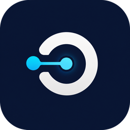
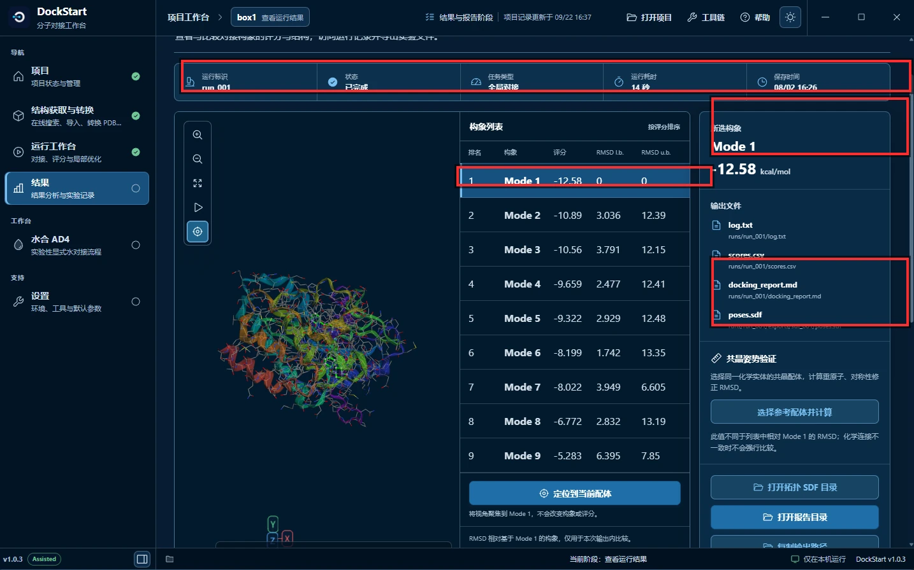

<p align="center"></p>
<h1 align="center">DockStart</h1>
<p align="center">基于 AutoDock Vina 的开源中文本地分子对接工作台</p>
<p align="center">
  
  
  
</p>
<p align="center">
  <a href="https://github.com/xuxinxi14/DockStart/releases/tag/v1.0.4">下载 v1.0.4</a> ·
  <a href="docs/quick_start_v1_0_4.md">快速开始</a> ·
  <a href="https://xuxinxi14.github.io/DockStart-Docs/">在线中文文档</a> ·
  <a href="docs/faq.md">常见问题</a>
</p>

DockStart 把输入准备、对接箱体设置、参数配置、任务运行、构象查看和实验记录整理到同一个本地项目。适合第一次使用 AutoDock Vina 的学生、教学演示和需要保存计算记录的用户。它调用现有 AutoDock Vina，不修改其搜索算法或评分函数。

> 本页的下载与教程基准为 **v1.0.4 Windows x64 试用版本**。公开下载目前提供 **Assisted EXE**，也能直接使用已有 PDBQT。它已经公开提供下载，但完整 EXE 安装/卸载、GUI 与全部科学门禁仍未完成，不能据此称为正式稳定版。后续开发工作区的版本字段不代表本页安装包已经更新。

## 软件界面


v1.0.4 的实际帮助页：按当前项目状态给出下一步建议，提供 19 个离线主题、错误码检索与在线文档入口。



结果页示意截图来自 v1.0.3 的 1IEP 教学案例；用于展示构象和评分查看，不作为 v1.0.4 新一次运行或预测准确率的证据。案例的完整操作与截图版本见 [1IEP 教程](https://xuxinxi14.github.io/DockStart-Docs/docs/part-b/cases/basic-docking-1iep/)。

## 下载与安装

到 [v1.0.4 发布页](https://github.com/xuxinxi14/DockStart/releases/tag/v1.0.4) 下载 `DockStart_1.0.4_Assisted_x64-setup.exe`，大小 **74,017,034 bytes（约 70.59 MiB）**。安装包未做 Authenticode 签名，可能显示“未知发布者”；请核对来源与 SHA256，不需要关闭安全软件。

```powershell
Get-FileHash -Algorithm SHA256 -LiteralPath .\DockStart_1.0.4_Assisted_x64-setup.exe
```

期望 SHA256：

```text
c495a08184817aa1619116957def9d0d3b30dc9e2d469e638e04565b95253ee2
```

| 安装档位 | 包含什么 | v1.0.4 公开下载 |
| --- | --- | --- |
| Basic | AutoDock Vina 与精简后端 Python；使用已有受体/配体 PDBQT | 当前未提供；已有 PDBQT 可直接使用 Assisted |
| Assisted | Basic 流程，另附 CPython 3.11、RDKit 2026.3.3、Meeko 0.7.1 等准备工具 | 提供 EXE |

两种档位共用应用身份，不能并行安装。项目存放在独立、可写的目录，升级或切换档位前备份项目。安装后先查看工具链检测；普通 Vina 对接不需要自行安装 Python、RDKit 或 AutoGrid4。详细说明见 [用户指南](docs/user_guide.md) 和 [发布说明](docs/release/v1_0_4_release_notes.md)。

## 第一次运行

```text
创建项目 → 导入结构 → 检查/准备 PDBQT → 设置对接箱体与参数
        → 运行前检查 → 运行 Vina → 查看构象与评分 → 导出实验记录
```

1. **先体验示例**：在帮助页点击“打开示例入口”，复制到自己的目录。内置小型数据只用于熟悉软件。
2. **使用自己的数据**：已有受体与配体 PDBQT 可直接导入；Assisted 可尝试从受体 PDB/CIF、配体 SDF/MOL/单分子 MOL2 准备输入，转换后仍需人工检查。
3. **确认搜索区域**：依据共晶配体、实验或文献设置对接箱体；“定位到受体”只是几何定位，不是口袋预测。
4. **运行与保存**：通过运行前检查，执行 AutoDock Vina，查看真实构象和评分，导出 CSV 与 Markdown 实验记录。

逐步说明见 [v1.0.4 快速开始](docs/quick_start_v1_0_4.md)。完整真实体系案例见 [1IEP 教程](https://xuxinxi14.github.io/DockStart-Docs/docs/part-b/cases/basic-docking-1iep/)；不要把其旧版截图或参考分数当作本次安装包的实测结果。

## 功能与边界

- **中文引导**：项目状态、参数解释、运行前阻塞项和错误恢复说明。
- **本地工作流**：项目、准备、对接与报告在本机进行。主动使用在线结构检索或在线文档时需要网络。
- **记录可追溯**：每次运行保存输入快照、配置、工具版本、命令、stdout/stderr、日志、时间、退出码和相关 SHA256。
- **结果查看**：三维构象、对接评分和 RMSD 表；输出 `scores.csv` 和 Markdown 实验记录。表格的 RMSD l.b./u.b. 相对本次 Mode 1，不能当作与实验结构的验证 RMSD。
- **按条件使用的进阶工作流**：姿势评分、局部优化、有限柔性受体、串行批量、maps、大环及实验性协议；条件与科学解释见 [进阶说明](docs/advanced_workflows.md)。存在入口不等于全部协议已通过当前安装包验收。

当前不提供 SMILES 自动准备、复杂受体修复、结合口袋预测、PLIP/ProLIF 相互作用分析、分子动力学、PDF 报告或 AI 药效判断。AutoGrid4 是用户自行安装的外部工具；Open Babel、PLIP 和 MGLTools 不随包提供。

**Docking score 仅供结构结合趋势参考，不能替代实验验证。** 输入结构、质子化、电荷、手性、缺失残基、水、金属和搜索区域需要人工复核。更低的分数不能直接证明真实结合、药效、安全性或临床价值。

## 源码、验证与维护

v1.0.4 的功能源码参考为 [`d314084`](https://github.com/xuxinxi14/DockStart/tree/d314084f246ce96cf0f4b56de888843b7c79c500)。原安装包来自保留的 dirty 候选构建，文件哈希与验证范围见 [发布记录](docs/release/v1_0_4_release_notes.md)；源码参考不是对历史打包字节的重建证明。

开发需 Node.js 24.14.1、Rust 1.90.0、Tauri Windows 构建依赖和 Python 3.11+。从源码运行时需要另行配置或装配工具，安装版的随包资源不代表干净源码已经具备完整发布环境。

```powershell
git clone https://github.com/xuxinxi14/DockStart.git
cd DockStart\apps\desktop
npm ci
npm run tauri dev
```

统一检查入口为仓库根目录的 `scripts/check_all.ps1`；部分外部验收测试需要固定 Vina 和逐字节匹配的 fixture，干净克隆未准备资源时可能失败。[最新核对的 Windows CI](https://github.com/xuxinxi14/DockStart/actions/runs/37022720578) 未通过，具体范围记录在发布说明中；不能以本地复验宣称全量源码门禁通过。检查入口和源码构建条件见 [Windows 打包说明](docs/release/windows_packaging.md) 与 [发布检查表](docs/release/release_checklist.md)。

仓库主要目录为 `apps/desktop/`、`backend/`、`resources/`、`docs/` 和 `scripts/`。历史 `test/DockStart/` 跟踪了一份运行布局，仅保留作为历史测试资源，不代表当前源码或推荐下载入口；它与未来“不提交 runtime”的资源策略尚待独立整理。

## 帮助、反馈与许可证

- [用户指南](docs/user_guide.md) · [FAQ](docs/faq.md) · [示例说明](docs/demo_projects.md)
- [在线中文文档](https://xuxinxi14.github.io/DockStart-Docs/) · [更新记录](CHANGELOG.md)
- [GitHub Issues](https://github.com/xuxinxi14/DockStart/issues)：附版本、安装档位、复现步骤、错误码和经过检查的日志；分享前删除不打算公开的个人路径与研究数据。
- DockStart 自有代码采用 [Apache-2.0](LICENSE)；随包第三方组件分别遵循自己的许可证，详见 [许可证记录](docs/license_notes.md)。
